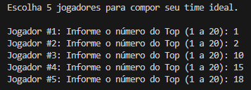

# 🏀 Time dos Sonhos da NBA

Este é um aplicativo feito em C# (.NET) que permite que o usuário monte seu próprio **time dos sonhos** com base nos 20 maiores jogadores da história da NBA.

## ✅ Funcionalidades

- Exibe os 20 melhores jogadores da história  

- Permite selecionar 5 jogadores únicos  

- Monta e exibe o time personalizado do usuário  

## 💻 Como usar

1. Execute o arquivo `.exe` ou `.dll` dentro da pasta publicada  
2. Siga as instruções no terminal para selecionar seus jogadores  
3. Veja seu time montado no final 🎉

## ⬇️ Download

👉 [Clique aqui para baixar a versão portátil do programa](./dist/dreamTeam.zip)

## 🔗 Site publicado via GitHub Pages

Acesse aqui:  
🌐 https://GabrielSL7.github.io/dreamTeam
